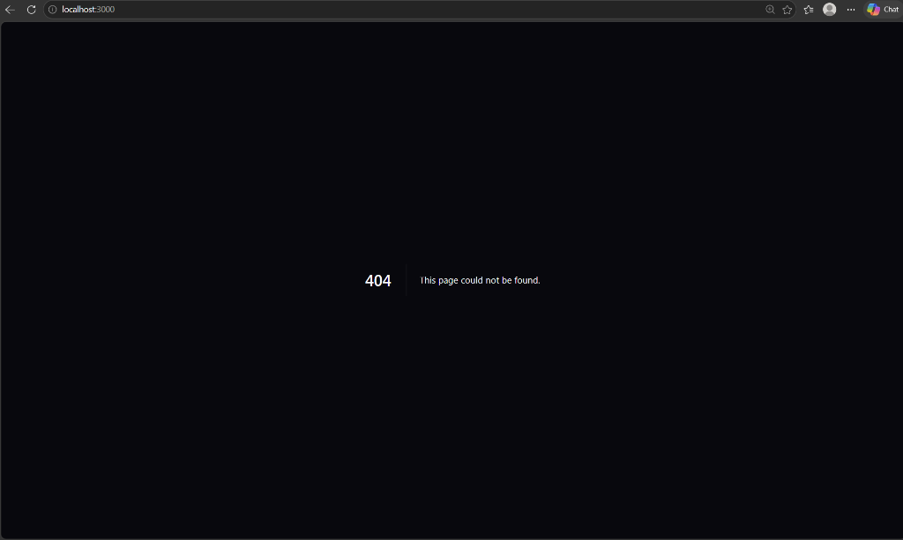
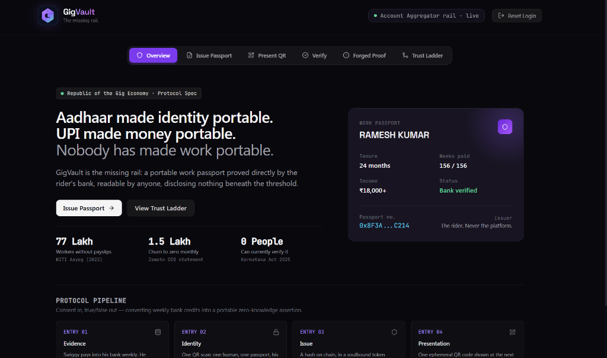
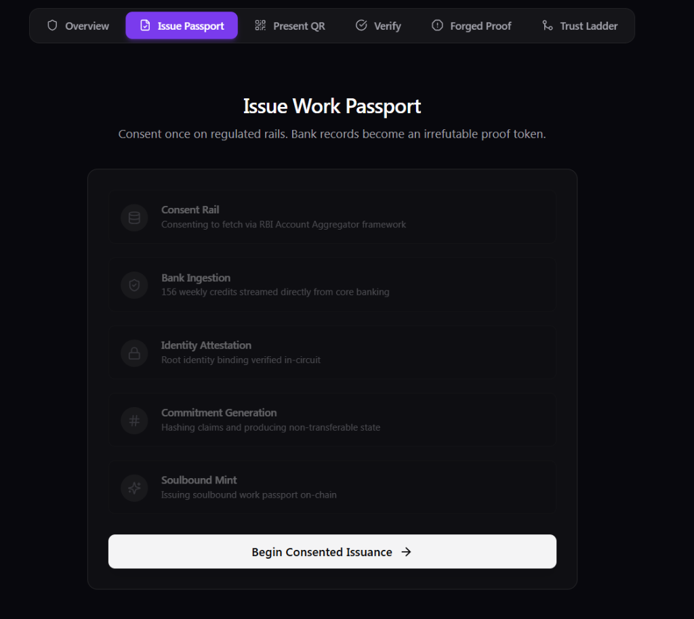
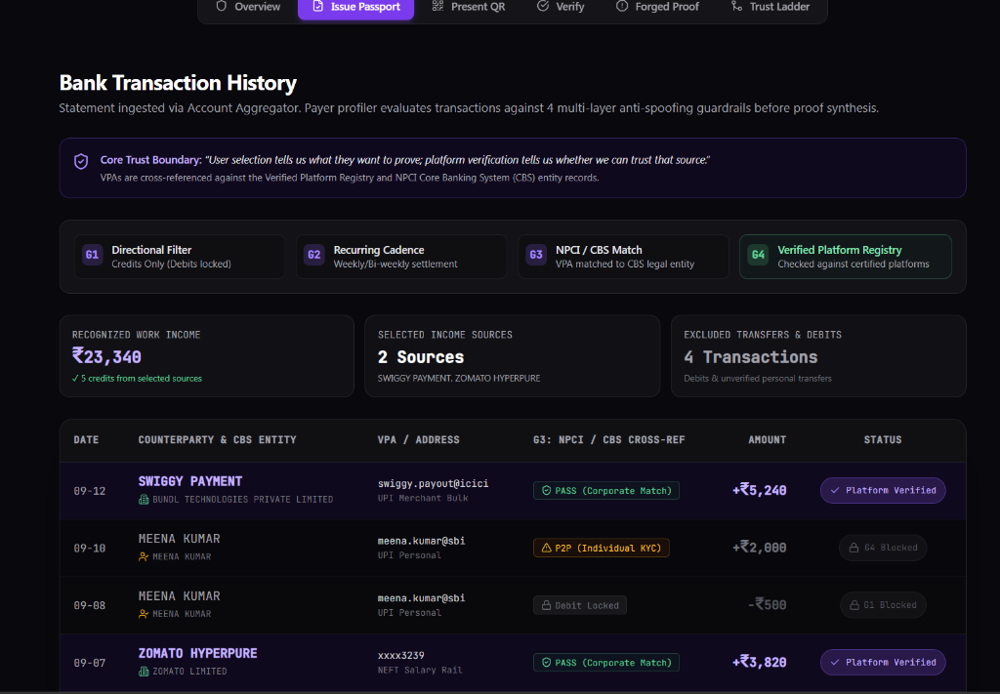
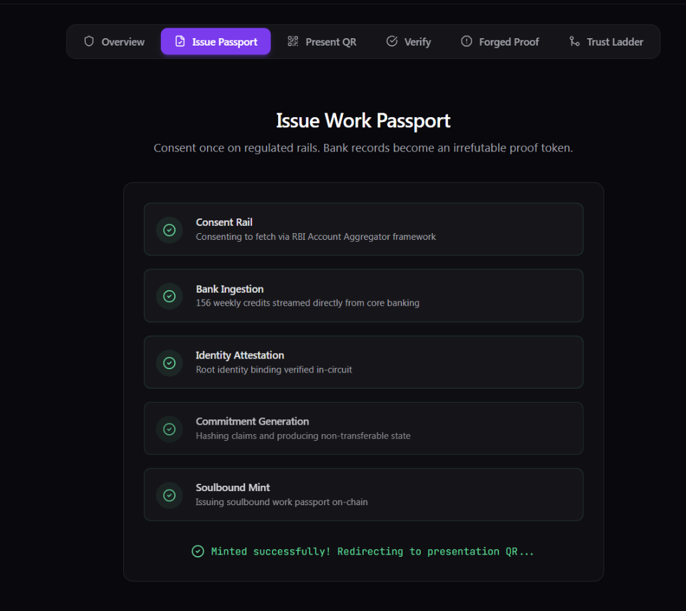

<div align="center">
  
  <h1>GigVault</h1>
  <p><strong>A work passport for gig workers — proved by the bank, held by the worker, readable by anyone, disclosing nothing underneath.</strong></p>
  <p>DSU DEVHACK 3.0 · Blockchain & FinTech · Team AI CODERS</p>
  <p><a href="https://gigvault-1.onrender.com/"><strong>▶ Live demo</strong></a> · <a href="#run-it-locally">Run locally</a> · <a href="#what-is-real-and-what-is-simulated">What is real vs simulated</a></p>
</div>

---

## The problem, in one line

> Aadhaar made identity portable. UPI made money portable. Nobody has made work portable.

77 lakh gig workers today, 2.35 crore by 2029-30 (NITI Aayog). 1.5 lakh leave one platform every month and start from zero. Ramesh has 156 weekly payouts sitting in his bank account — three years of proof — and not one platform, landlord, or lender can read it. Karnataka's Gig Workers Act 2025 promises a portable ID. None has been issued.

## What GigVault does

1. **Consent.** The rider approves once on the RBI Account Aggregator rail. His bank sends the signed statement. His platform is never asked.
2. **Derive.** We compute three numbers — tenure, weeks paid, monthly income — from *platform payouts only* (see "What counts as income").
3. **Prove.** A Groth16 zero-knowledge proof commits to those numbers and proves they clear fixed thresholds. The verifier learns *"≥ 24 months, ≥ 100 weeks, ≥ ₹18,000"* — never ₹22,918.
4. **Issue.** An ERC-5192 soulbound token carries the commitment, issuer, date and a revocation flag. Minted to the rider's own wallet. One Aadhaar, one passport. No figure, name, or Aadhaar number on chain.
5. **Present.** One QR, signed by the rider's wallet, single-use, 120 seconds. Any phone camera opens the verifier.
6. **Admit.** True or false in under 100 ms, plus *who paid him and for how many weeks* — never how much.

---

## 📸 Platform Walkthrough

We built a premium, dark-mode, glassmorphism UI to make complex cryptography feel entirely frictionless.

### 1. Zero-Knowledge Aadhaar e-KYC
> *Identity verification happens locally in the browser via WebAssembly. No data leaves the device.*
<p align="center"></p>

### 2. The GigVault Dashboard
> *Once verified, workers enter their private vault. Their aggregated FinTech data (income, reputation) is visualized securely.*
<p align="center"></p>

### 3. Consent Rail (Account Aggregator)
> *Workers issue a Work Passport by cryptographically committing to specific, derived data tiers—never raw data.*
<p align="center"></p>

### 4. Zero-Knowledge Derivation
> *The platform proves income stability mathematically, protecting the worker's privacy.*
<p align="center"></p>

### 5. On-Chain Soulbound Mint
> *The final product: a time-limited ephemeral QR code or a direct on-chain Passport ID ready for Web3 protocols or Web2 employers.*
<p align="center"></p>

---

## What counts as income — the Round-1 question

A bank account is not a payslip. Four layers, in a fixed order, each catching what the one before cannot:

| Layer | Rule | Catches |
|---|---|---|
| 1 · Transaction ID | Each transaction counted once; cash/cheque deposits are never payouts | Duplicated statements, "CASH DEP SWIGGY" |
| 2 · Remitter name | Only known gig platforms (Swiggy/Bundl, Zomato, Uber, Ola, Rapido, Dunzo, Blinkit, Zepto, Porter, Amazon Flex, Urban Company, BigBasket — configurable) **count** | Friends' UPI, refunds, self-transfers |
| 3 · Frequency | Unlisted payers paying in ≥ 60 % of weeks over ≥ 12 weeks are **surfaced**; counted only if the rider confirms, and then **named on the passport as "rider-confirmed"** | Platforms we don't list yet, payout providers |
| 4 · Transaction graph | Across every account the consent returned: a credit matched to a same-day, same-amount debit from the rider's **own** account is a cycle, not income — and a payer that is mostly cycles can never be confirmed | Manufactured regularity (moving your own money weekly, labelled "PAYOUT") |

On the demo statement: 300 credits → 156 Swiggy payouts counted, 144 ignored, 1 duplicate and 1 cash deposit dropped, one unlisted weekly payer surfaced, one manufactured payer (30 own-account cycles) blocked. The verifier sees `Paid by: SWIGGY · 156 wks` — and nothing else.

## What you cannot do — each one demonstrated live

| Attempt | Result |
|---|---|
| Edit the income figure (judge picks a higher band on the real proof) | `PROOF_INVALID_FOR_EDITED_CLAIM` — no proof exists for a claim the bank didn't support |
| Upload your own statement | There is no upload. Only the bank-signed envelope is accepted |
| Second passport, same Aadhaar, new email | `NULLIFIER_REUSED` |
| Scan someone else's Aadhaar | `NAME_MISMATCH` against the bank account holder |
| Show a friend's QR | `HOLDER_SIGNATURE_INVALID` — only the wallet that owns the token can sign |
| Screenshot a QR and reuse it | `QR_ALREADY_USED` / `QR_EXPIRED` |
| Sell or lend the token | `transferFrom` reverts — soulbound |
| Fraud found later | `revoke` → every scan says no, on chain |

## Numbers

Groth16 circuit: 922 constraints. Prove: **~180 ms** warm (first call ~1–3 s). Verify: **~20 ms**. On-chain mint: 372k gas; on-chain admit: 249k gas. End-to-end scan → answer: **< 100 ms** server-side. **35 automated end-to-end checks** (`backend/scripts/http-smoke.mjs`) and 26 unit tests cover every row in the two tables above.

## Who you have to trust — and how we take ourselves off that list

| Level | What is proved | Status |
|---|---|---|
| 0 | Nothing — we read figures and commit them | Refused |
| **1** | **The pull:** the bank-signed AA envelope is published beside every token. The arithmetic is still ours, but visible | **Shipped** |
| 2 | Independent operators co-sign before issue | Next |
| 3 | Zero-knowledge proof over the signed ciphertext — trust nobody | Research |

## What is real and what is simulated

| Component | Status |
|---|---|
| Groth16 circuit, proving, verification (Circom + snarkjs) | Real, executed |
| ERC-5192 soulbound passport, on-chain Groth16 verifier, admission & revocation (Solidity) | Real, deployed to a local Hardhat chain in the demo; Polygon Amoy is a config change |
| Rider wallet: EVM key on device, EIP-191 presentation signatures, presenter must be `ownerOf` | Real |
| Privy email login → embedded wallet (`rider/`) | Real, logged in and issued; SMS is US/Canada-only on Privy, so login is by email |
| Income rules, transaction graph, named sources | Real, run on every statement |
| QR present / scan, camera on both sides, phone-camera → verifier | Real |
| **Bank feed** | **Simulated** — a signed mock FIP emitting the exact Account Aggregator schema, with realistic noise. Sandbox access (Setu/Finvu) takes days; the adapter interface is the plug-in point |
| **Aadhaar** | **Decode only** — the Secure QR is decoded on device and the name matched to the bank; UIDAI's signature is not yet verified and no Anon Aadhaar proof is generated. Next milestone, same library |
| Selective disclosure | At issue time only; per-presentation re-proving is next |

We would rather you know this than find it.

## Architecture

```
rider phone ──consent──▶ AA rail (bank) ──signed envelope──▶ operator (Fastify)
                                                             │  derive · graph · Groth16 prove
                                                             ▼
                                              Polygon (ERC-5192 passport + verifier)
                                                             ▲
verifier ◀── QR (single-use, wallet-signed) ── rider    admit: proof · owner · revocation
```

- `backend/` — Fastify + node:sqlite; AA adapter (mock FIP), derivation + graph, Circom circuit and Groth16 pipeline, chain client, all routes.
- `contracts/` — `GigVaultPassport` (ERC-721 + ERC-5192), `GigVaultVerifier` (generated), `GigVaultAdmission`; Hardhat; local and Amoy deploy scripts.
- `frontend/` — Next.js 14 demo UI: Issue → Present → Verify → Forged Proof.
- `rider/` — Vite + React rider app with Privy login and embedded wallet.

## Run it locally

```bash
# 1. circuit (needs circom on PATH — see backend/scripts/build-circuit.mjs)
cd backend && npm install && npm run circuit:build
# 2. chain + contracts
cd ../contracts && npm install && npx hardhat node          # window 1
npx hardhat run scripts/deploy.ts --network localhost      # window 2
# 3. backend (CHAIN_MODE=on in backend/.env to mint on chain)
cd ../backend && npm run dev                               # http://localhost:4000
# 4. UI
cd ../frontend/GigVault-main && npm install && npm run dev  # http://localhost:3000
# 5. prove it
cd ../../backend && node scripts/http-smoke.mjs            # expect: ALL HTTP CHECKS PASSED
```

## Roadmap

- **Weeks:** Account Aggregator sandbox (Setu/Finvu) replacing the mock FIP; Anon Aadhaar signature check and nullifier on the phone; Polygon Amoy deploy as default.
- **Months:** per-presentation re-proving (show a lender less than you earned); independent co-signing operators (Level 2); Kannada UI; verifier billing per check.
- **Research:** proof over the AA-signed ciphertext (Level 3) — trust nobody, not even us.

Every bank-paid worker without a payslip — drivers, delivery, domestic work — is the same rail.

---
<div align="center"><em>Sources: NITI Aayog (2022), Economic Survey 2023-24, RBI Account Aggregator framework / Sahamati, Karnataka Gig Workers Act & Rules 2025, DPDP Act 2023.</em></div>
